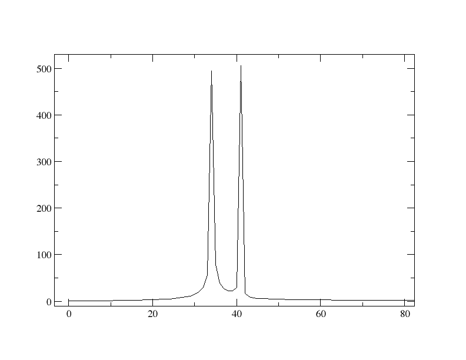

# ReTFeT
a Real Time Fourier Embedded Transform

##Contributors
[Elijah Jensen](http://ejensen141.github.io), M.S.  
Department of Physics & Astronomy  
University of Louisville

[Geoffrey Lentner](http://glentner.github.io), M.S.  
Department of Physics  
University of Notre Dame

## Example Tests

